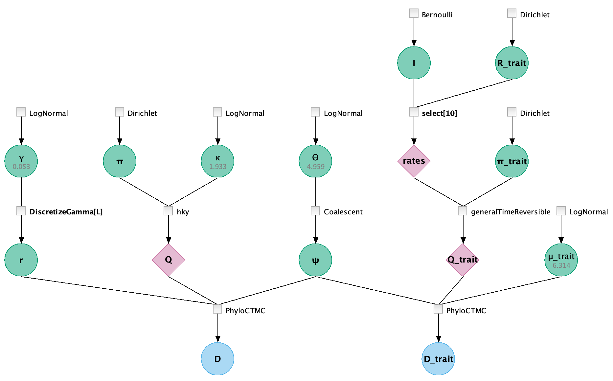

## Code

data {
 
&nbsp;&nbsp;options = {ageDirection="forward", ageRegex="_(\d+)$"};
 
&nbsp;&nbsp;D = readNexus(file="examples/H5N1.nex", options=options);
 
&nbsp;&nbsp;L = D.nchar();
 
&nbsp;&nbsp;taxa = D.taxa();
 
&nbsp;&nbsp;D_trait = extractTrait(taxa=taxa, sep="_", i=2);
 
&nbsp;&nbsp;K = D_trait.stateCount();
 
&nbsp;&nbsp;dim = K*(K-1)/2;
 
}
 
model {
 
&nbsp;&nbsp;π ~ Dirichlet(conc=[2.0, 2.0, 2.0, 2.0]);
 
&nbsp;&nbsp;κ ~ LogNormal(meanlog=1.0, sdlog=1.25);
 
&nbsp;&nbsp;γ ~ LogNormal(meanlog=0.0, sdlog=2.0);
 
&nbsp;&nbsp;r ~ DiscretizeGamma(shape=γ, ncat=4, replicates=L);
 
&nbsp;&nbsp;Θ ~ LogNormal(meanlog=0.0, sdlog=1.0);
 
&nbsp;&nbsp;ψ ~ Coalescent(taxa=taxa, theta=Θ);
 
&nbsp;&nbsp;D ~ PhyloCTMC(Q=hky(kappa=κ, freq=π), mu=0.004, siteRates=r, tree=ψ);
 
&nbsp;&nbsp;π_trait ~ Dirichlet(conc=rep(element=3.0, times=K));
 
&nbsp;&nbsp;I ~ Bernoulli(minSuccesses=dim-2, p=0.5, replicates=dim);
 
&nbsp;&nbsp;R_trait ~ Dirichlet(conc=rep(element=1.0, times=dim));
 
&nbsp;&nbsp;Q_trait = generalTimeReversible(rates=select(x=R_trait, indicator=I), freq=π_trait);
 
&nbsp;&nbsp;μ_trait ~ LogNormal(meanlog=0, sdlog=1.25);
 
&nbsp;&nbsp;D_trait ~ PhyloCTMC(L=1, Q=Q_trait, dataType="standard", mu=μ_trait, tree=ψ);
 
}
 

## Graphical Model

<figure class="image">
  
  <figcaption>{{ include.fignum }}: The graphical model</figcaption>
</figure>

For the details, please read the auto-generated [narrative](#auto-generated) from LPhyStudio.
