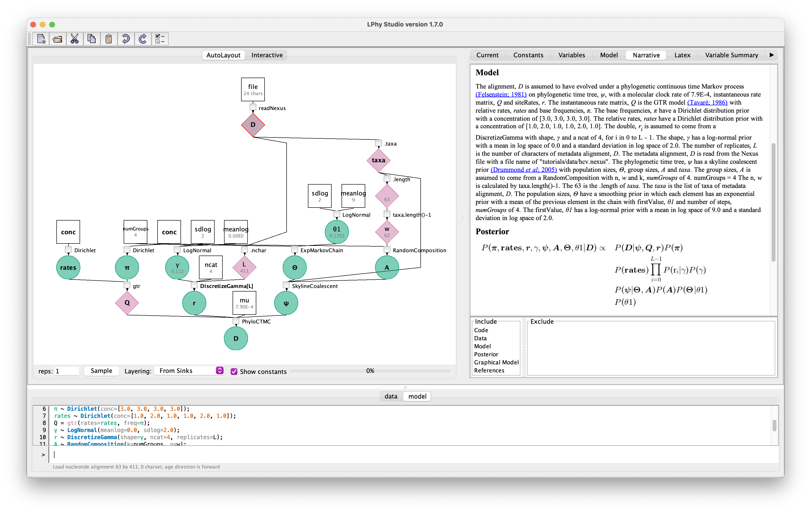

## Code





## Graphical Model

<figure class="image">
  
  <figcaption>{{ include.fignum }}: The graphical model</figcaption>
</figure>

For the details, please read the auto-generated [narrative](#auto-generated) from LPhyStudio.
