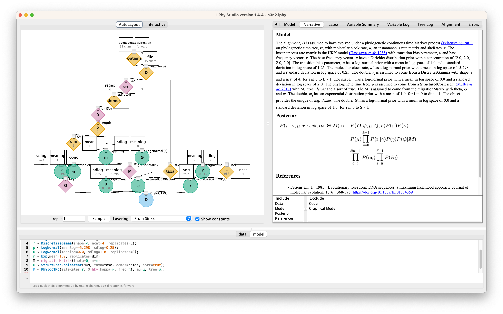

## Code
data {
 
&nbsp;&nbsp;options = {ageDirection=&quot;forward&quot;, ageRegex=&quot;.\*\\|.\*\\|(\\d\*\\.\\d+|\\d+\\.\\d\*)\\|.\*$&quot;};
 
&nbsp;&nbsp;D = readNexus(file=&quot;data/h3n2.nexus&quot;, options=options);
 
&nbsp;&nbsp;L = D.nchar();
 
&nbsp;&nbsp;demes = split(str=D.taxaNames(), regex=&quot;\\|&quot;, i=3);
 
&nbsp;&nbsp;S = length(unique(arg=demes));
 
&nbsp;&nbsp;dim = S*(S-1);
 
&nbsp;&nbsp;taxa = D.taxa();
 
}
 
model {
 
&nbsp;&nbsp;π ~ Dirichlet(conc=[2.0, 2.0, 2.0, 2.0]);
 
&nbsp;&nbsp;κ ~ LogNormal(meanlog=1.0, sdlog=1.25);
 
&nbsp;&nbsp;μ ~ LogNormal(meanlog=-5.298, sdlog=0.25);
 
&nbsp;&nbsp;γ ~ LogNormal(meanlog=0.0, sdlog=2.0);
 
&nbsp;&nbsp;r ~ DiscretizeGamma(shape=γ, ncat=4, replicates=L);
 
&nbsp;&nbsp;m ~ Exp(mean=1.0, replicates=dim);
 
&nbsp;&nbsp;Θ ~ LogNormal(sdlog=1.0, meanlog=0.0, replicates=S);
 
&nbsp;&nbsp;M = migrationMatrix(theta=Θ, m=m);
 
&nbsp;&nbsp;ψ ~ StructuredCoalescent(M=M, demes=demes, sort=true, taxa=taxa);
 
&nbsp;&nbsp;D ~ PhyloCTMC(Q=hky(kappa=κ, freq=π), mu=μ, siteRates=r, tree=ψ);
 
}
 

## Graphical Model

<figure class="image">
  
  <figcaption>{{ include.fignum }}: The graphical model</figcaption>
</figure>

For the details, please read the auto-generated [narrative](#auto-generated) from LPhyStudio.
